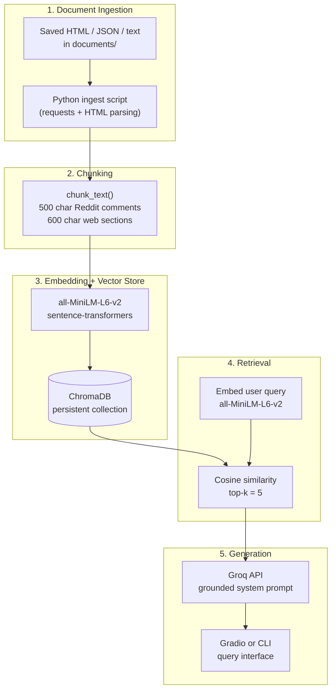

# Project 1 Planning: The Unofficial Guide

> Write this document before you write any pipeline code.
> Your spec and architecture diagram are what you'll use to direct AI tools (Claude, Copilot, etc.) to generate your implementation — the more specific they are, the more useful the generated code will be.
> Update the Retrieval Approach and Chunking Strategy sections if you change your approach during implementation.
> Update this file before starting any stretch features.

---

## Domain

**NYU off-campus housing experiences and survival advice for students**

This unofficial guide focuses on NYU students' off-campus housing experiences: where students look for housing, what rent ranges they report, which neighborhoods come up often, how early they search, and what tradeoffs they face compared with dorming. This knowledge is hard to find because the most useful advice is scattered across Reddit threads, NYU resource pages, commuter-life posts, and housing portals rather than being organized in one student-friendly guide. The system should answer practical student questions using both official NYU resources and unofficial lived-experience discussions.

---

## Documents

| # | Source | Description | URL or location |
|---|--------|-------------|-----------------|
| 1 | r/nyu megathread: searches for on-campus or off-campus housing | Broad student Q&A on housing search, budgets, neighborhoods, and timing | https://www.reddit.com/r/nyu/comments/18elmin/megathread_searches_for_oncampus_or_offcampus/ |
| 2 | How hard is it to live off campus? | Student perspectives on feasibility, logistics, and first-year off-campus living | https://www.reddit.com/r/nyu/comments/1ibva9c/how_hard_is_it_to_live_off_campus/ |
| 3 | Where do students find off-campus apartments these days? | Platforms, brokers, Facebook groups, and search strategies students report using | https://www.reddit.com/r/nyu/comments/1jai7o9/where_do_students_find_offcampus_apartments_these/ |
| 4 | For those living off campus, how much is rent? | Student-reported rent ranges, roommate splits, and budget expectations | https://www.reddit.com/r/nyu/comments/muupej/for_those_who_are_living_off_campus_how_much_is/ |
| 5 | How long before the start of the semester did you start looking? | Timing advice for when to begin apartment hunting before fall | https://www.reddit.com/r/nyu/comments/o1r94w/people_living_offcampus_how_long_before_the_start/ |
| 6 | Questions regarding off-campus housing | General off-campus FAQ: leases, guarantors, neighborhoods, and process | https://www.reddit.com/r/nyu/comments/avc7qv/questions_regarding_offcampus_housing/ |
| 7 | Is it cheaper to live on or off campus? | Cost comparisons and tradeoffs between dorming and renting | https://www.reddit.com/r/nyu/comments/twlt4z/is_it_cheaper_to_live_on_or_off_campus/ |
| 8 | NYU Off-Campus Housing portal | Official listings, roommate search, renter resources, and university housing support | https://offcampushousing.nyu.edu/ |
| 9 | Home away from campus: NYU's commuter community | Commuter student life, campus resources, and off-campus community support | https://meet.nyu.edu/life/campus-resources/home-away-from-campus-nyus-commuter-community/ |
| 10 | Should I live off or on campus as an NYU student? | NYU guidance on on-campus vs. off-campus pros, cons, and decision factors | https://meet.nyu.edu/life/residential-life/should-i-live-off-or-on-campus-as-an-nyu-student/ |

**Additional candidate sources (not in primary set):**

- https://www.reddit.com/r/nyu/comments/142hmm9/transfer_off_campus_housing/
- https://www.reddit.com/r/nyu/comments/18kwk55/off_campus_students_how_much_do_you_pay_for_rent/
- https://www.nyu.edu/students/student-information-and-resources/housing-and-dining.html
- https://meet.nyu.edu/life/settling-into-your-off%E2%80%91campus-apartment-a-commuter-students-guide-to-lic/

### Document Skim Notes

**Reddit sources:** Mostly short, conversational posts and comments. Useful for student-reported budgets, roommate experiences, neighborhood suggestions, timing advice, scams, and tradeoffs between dorming and renting. Key facts are often concentrated in individual comments, so later chunking should preserve comment-level context instead of merging entire threads into one large chunk.

**Official NYU and Meet NYU sources:** More structured and reliable for university-provided information: the NYU Off-Campus Housing portal, roommate search, renter resources, commuter support, student-life guidance, and on-campus versus off-campus tradeoffs. These pages are better chunked by section heading or short paragraph because their information is organized by topic.

### Checkpoint Questions

Questions the system should be able to answer after the pipeline is built:

1. How much do NYU students usually pay for off-campus rent?
2. Which neighborhoods do students mention as realistic on a budget?
3. How early should I start looking for an apartment before fall semester?
4. Is living off campus cheaper or better than dorming?
5. Where do NYU students look for roommates, sublets, or apartments?

---

## Chunking Strategy

**Chunk size:**

- **Reddit sources:** One chunk per comment (or post body) when the text is ≤500 characters. Comments longer than 500 characters are split at sentence boundaries into segments of at most 500 characters.
- **Official NYU / Meet NYU pages:** Split first on section headings (H2/H3), then on paragraph boundaries. Each chunk is at most 600 characters. The section heading is prepended to every chunk from that section (e.g., `[On-campus vs off-campus costs]`).

**Overlap:**

- **Reddit:** 80 characters (~16%) overlap only when splitting a single long comment across multiple chunks. Whole comments under the limit get no overlap — they stay atomic.
- **Official pages:** 100 characters overlap between consecutive chunks when a single section exceeds 600 characters, so facts that span two paragraphs (e.g., a cost comparison split across sentences) still appear in at least one retrievable chunk.

**Reasoning:**

This corpus mixes two shapes of text. Reddit threads are short, opinion-based comments where a rent figure, neighborhood name, or timing tip usually lives in one comment — merging an entire thread would produce chunks too large for precise retrieval and mix unrelated advice. Official pages are structured guides where paragraph-level chunks under a heading preserve NYU's topic organization.

If chunks were **too small** (e.g., <150 characters), retrieval would return fragments like `"$1,600/month"` without borough, roommate count, or year — the model could not answer budget questions accurately. If chunks were **too large** (e.g., whole Reddit threads), a query about "when to start looking" would pull in unrelated rent and roommate comments from the same thread, producing noisy or contradictory context. Overlap on long splits reduces the risk that a key fact sitting on a sentence boundary appears in neither adjacent chunk.

Each chunk will include lightweight metadata prepended to the text: source URL, document type (`reddit` or `official`), and thread title or page section — so generation can attribute answers even when comment bodies are short.

---

## Retrieval Approach

**Embedding model:**

`all-MiniLM-L6-v2` via `sentence-transformers` (384-dimensional embeddings, runs locally, included in `requirements.txt`). It performs well on short English Q&A text and keeps ingestion fast on a laptop without an embedding API.

**Top-k:**

**5 chunks** per query.

- **Too few (k=1–2):** A rent question might retrieve only one student anecdote and miss the range of reported prices or an official NYU cost-comparison paragraph.
- **Too many (k=8+):** Reddit noise increases — unrelated comments from popular threads dilute the Groq prompt, raise token cost, and make contradictory student reports harder for the model to summarize honestly.

Semantic search works here because the embedding model maps paraphrases to similar vectors — a query like "affordable neighborhoods for NYU" can match chunks that say "Bushwick on a budget" or "cheaper in Brooklyn" even without exact keyword overlap.

**Production tradeoff reflection:**

If cost were not a constraint and this served real NYU students at scale, I would weigh:

- **Accuracy on colloquial / domain text:** Larger models (e.g., `bge-large-en-v1.5`, OpenAI `text-embedding-3-large`) may better match student slang, neighborhood nicknames, and informal Reddit phrasing.
- **Context length:** Some Meet NYU pages have longer explanatory paragraphs; models with longer input windows could embed section-level context without splitting as aggressively.
- **Multilingual support:** International students may query in languages other than English; `multilingual-e5-large` or similar would matter for a global audience.
- **Latency and hosting:** `all-MiniLM-L6-v2` runs locally (privacy, no per-query embedding fee). A hosted embedding API adds network latency but removes RAM load during index builds on weak devices.

For this project, local MiniLM is the right balance of speed, simplicity, and quality on short English chunks.

---

## Evaluation Plan

| # | Question | Expected answer |
|---|----------|-----------------|
| 1 | How much do NYU students usually pay for off-campus rent? | Student threads report a **wide range, commonly about $1,000–$2,000+ per person per month**, depending on roommates, borough, and apartment quality; some pay less in outer Brooklyn or Queens with multiple roommates. A correct response must treat these as **student-reported estimates**, not a single official NYU price, and may note utilities/broker fees are extra. |
| 2 | Which neighborhoods do NYU students mention as realistic on a budget? | Answers should name **outer-borough or commuter-friendly areas** such as **Brooklyn** (Bushwick, Bed-Stuy, Sunset Park, Bay Ridge), **Queens** (Astoria and similar), **Jersey City/Hoboken**, or **Washington Heights/Inwood** — and should **not** treat East Village or Greenwich Village as typical budget picks. |
| 3 | How early should I start looking for an apartment before fall semester? | Students commonly recommend starting **about 2–3 months before move-in** (often **May–June for an August/September** start). A correct answer may add that competitive areas reward earlier searches and that **summer is peak apartment-hunting season**. |
| 4 | Is living off campus cheaper or better than dorming? | **Neither universally.** Off-campus can save money with roommates farther from campus but adds commute time, utilities, furniture, and broker fees; NYU/Meet NYU sources emphasize on-campus housing for convenience and fewer logistics. A correct answer presents **tradeoffs**, not a single yes/no, and distinguishes **official guidance** from **student opinions**. |
| 5 | Where do NYU students look for roommates, sublets, or apartments? | Must mention **NYU Off-Campus Housing portal** (listings and roommate search) plus several student-reported platforms such as **StreetEasy**, **Facebook NYU housing groups**, **Leasebreak**, **Roomi**, **Craigslist**, and **r/nyu** — at least three non-NYU sources alongside the portal. |

---

## Anticipated Challenges

1. **Contradictory student reports on the same topic.** Reddit threads often contain conflicting rent figures and neighborhood recommendations (e.g., one student pays $950 in Brooklyn with three roommates, another pays $2,200 in Manhattan). Retrieval may return both; the generator must summarize a range and note variability rather than picking one comment as fact.

2. **Comment context lost at chunk boundaries.** If ingestion strips thread titles or merges unrelated comments, a chunk reading `"I pay $1,600"` may rank highly for rent queries but omit borough and roommate count. Mitigation: prepend thread title and source metadata to every Reddit chunk; keep comments atomic when possible.

3. **Official vs unofficial source confusion.** A vivid Reddit anecdote may outrank a quieter NYU portal paragraph on cost comparisons. The system must surface **source type** in the prompt so the model can weight official resources for policy-style questions and Reddit for lived-experience detail.

4. **Time-sensitive advice.** Housing platforms, rents, and scams discussed in older threads may be outdated. Retrieval cannot know post dates unless metadata is preserved during ingestion — answers should acknowledge when advice may be stale.

---

## Architecture

**Stage summary**

| Stage | Tool / library |
|-------|----------------|
| Document Ingestion | Python, saved copies of Reddit threads and NYU/Meet NYU pages in `documents/` |
| Chunking | Custom `chunk_text()` with Reddit vs official-page rules |
| Embedding + Vector Store | `all-MiniLM-L6-v2` via `sentence-transformers` → `ChromaDB` |
| Retrieval | ChromaDB similarity search, top-k = 5 |
| Generation | Groq API (`groq` SDK) + `python-dotenv` for `GROQ_API_KEY` |

---

## AI Tool Plan

**Milestone 3 — Ingestion and chunking:**

- **Tool:** Cursor / Claude
- **Input:** The Documents table, Document Skim Notes, and Chunking Strategy sections of this file; the list of 10 source URLs
- **Expected output:** An `ingest.py` script that saves each source into `documents/` (Reddit as JSON or plain text, web pages as HTML or extracted text) and a `chunk.py` module with `chunk_text()` implementing the hybrid rules (500-char Reddit comments with metadata, 600-char web sections with heading prepended, overlap only on long splits)
- **Verification:** Run ingestion on all 10 sources; print chunk count per document; manually inspect 5 random chunks to confirm no whole-thread mega-chunks and that metadata (URL, thread title, section heading) is present

**Milestone 4 — Embedding and retrieval:**

- **Tool:** Cursor / Claude
- **Input:** Retrieval Approach section, Architecture diagram, and sample output from `chunk.py`
- **Expected output:** A `build_index.py` script that embeds all chunks with `all-MiniLM-L6-v2` and stores them in a persistent ChromaDB collection; a `retrieve.py` module with `get_relevant_chunks(query, k=5)` returning chunk text, metadata, and similarity scores
- **Verification:** Run the 5 Evaluation Plan questions through retrieval only; confirm top chunks mention relevant keywords (rent amounts, neighborhood names, platform names, timing) and include both Reddit and official sources where appropriate

**Milestone 5 — Generation and interface:**

- **Tool:** Cursor / Claude
- **Input:** Evaluation Plan (questions + expected answers), Anticipated Challenges section, Architecture diagram, and `retrieve.py` interface
- **Expected output:** A `generate.py` module that loads retrieved chunks into a Groq prompt with a system instruction to answer only from context, cite source URLs, distinguish official vs student reports, and say "I don't know" when context is insufficient; a simple Gradio or CLI query interface wiring retrieval → generation
- **Verification:** Run all 5 evaluation questions end-to-end; compare responses against the Expected answer column; note any failures for the README Failure Case Analysis section
